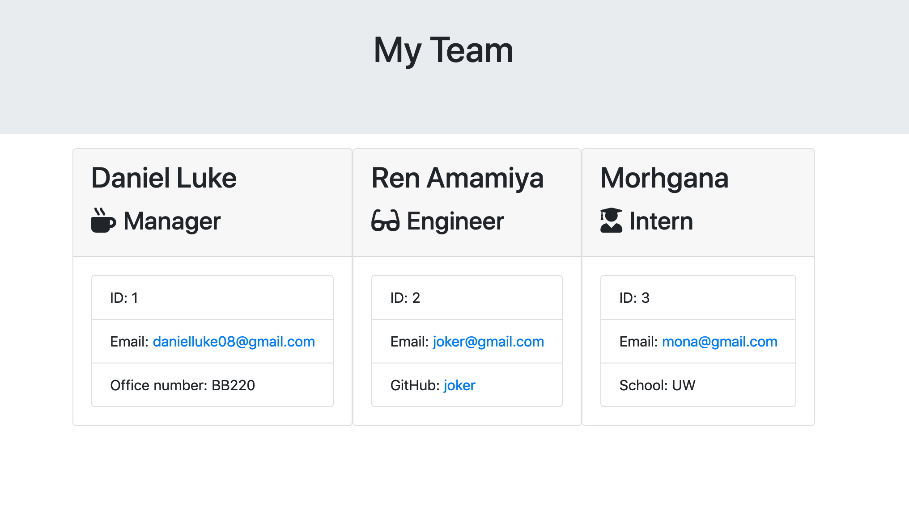

# Team Profile Generator
[](https://github.com/gidmp/)

[](code_of_conduct.md) 


## Description
------

a CLI based app takes user input in order to create employee info card using HTML

## Table of Contents 
------

* [Installation](#installation)

* [About](#about)

* [Demo](#demo)

* [Author](#author)

* [Questions](#questions)


## Installation

To install necessary dependencies, run the following command:

```
npm i

```

## About
------
This is a software engineer team builder made with constructors, classes and CLI as it's focus. Inquirer.js were used as a main tool to gather user input as building blocks for this app. the received input arranged in place using constructor and OOP and then rendered using htmlrenderer.js to the output folder.

## Demo
------

### CLI usage


### Resulting page




## Author
------

**Daniel Luke Tanoeihusada**

* Github : [gidmp](https://github.com/gidmp/)


## Questions
------


If you have any questions, please contact me, [Daniel Luke Tanoeihusada](danielluke08@gmail.com) directly at danielluke08@gmail.com


